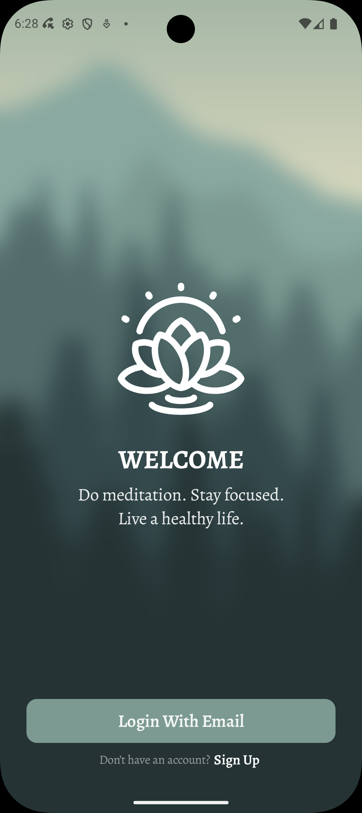
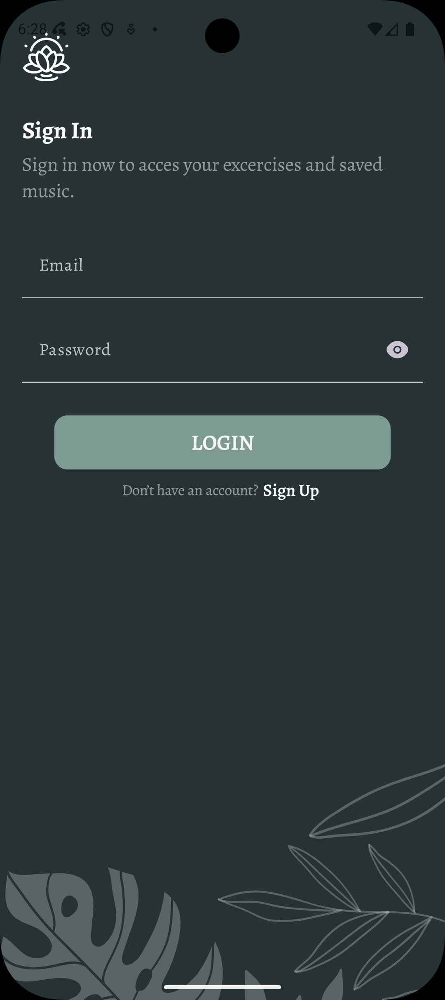
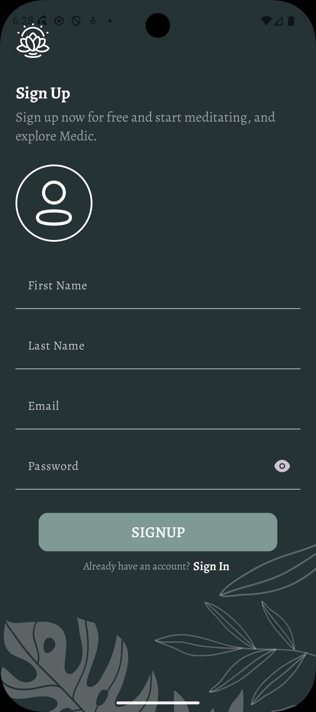
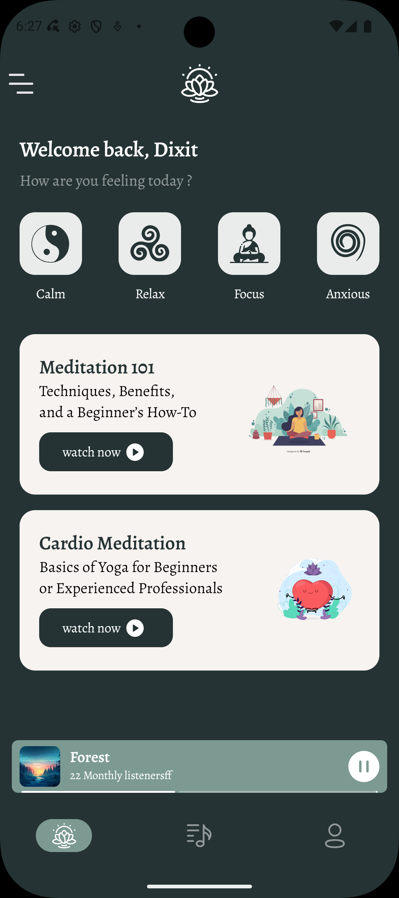
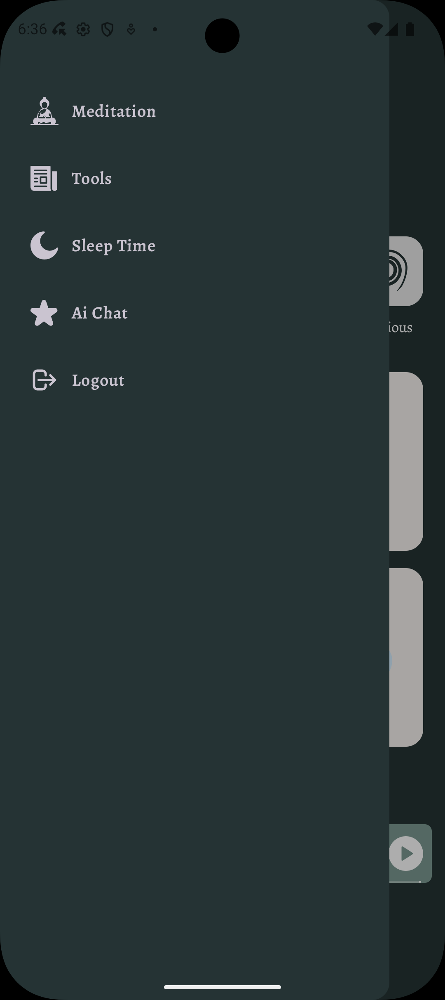
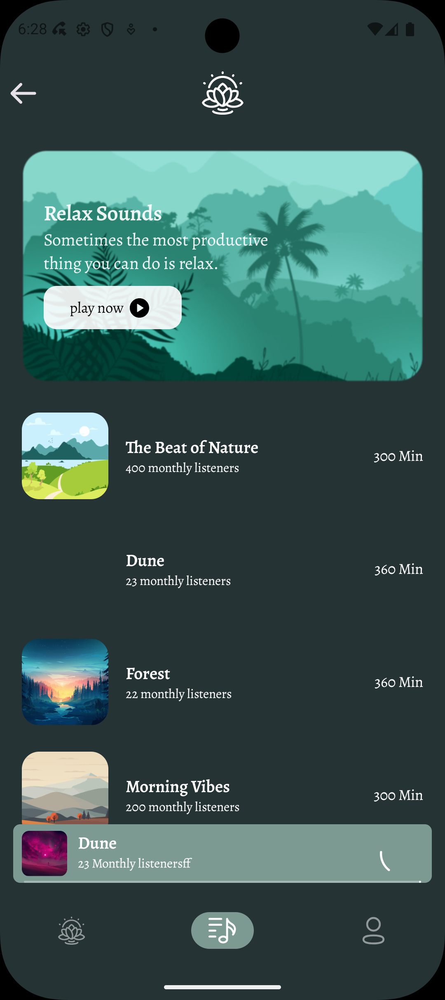
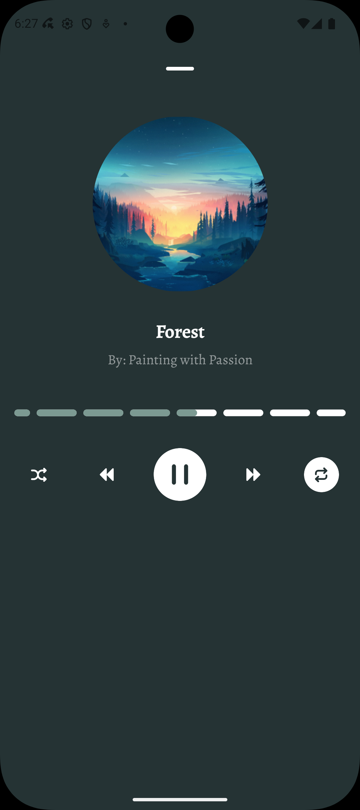

# 🌿 Meditation App

A simple and calming **Meditation App** built with **Jetpack Compose**, designed to help users relax, focus, and build mindfulness habits.

---

## ✨ Features

- 🧘 Guided meditation experience
- 🎵 Play relaxing tunes
- 🔐 User authentication (Login & Signup)
- 📂 Organized meditation/tune list
- 🎧 Built-in audio player
- 🌙 Clean and minimal UI

---

## 📸 Screenshots

<p align="center">
  
  
  
  
  
  
  
</p>

---

## 🏗️ Architecture

- MVVM (Model–View–ViewModel)
- Clean architecture approach
- Reactive UI using StateFlow

---

## 🛠️ Tech Stack

- Jetpack Compose – UI
- Kotlin – Programming language
- MediaPlayer – Audio playback
- Firebase (Auth/Storage/Firestore) *(if used)*
- Navigation Compose – Navigation
- Koin / Hilt – Dependency Injection *(based on your setup)*

---

## 🚀 Getting Started

1. Clone the repository

```bash
git clone https://github.com/your-username/your-repo-name.git